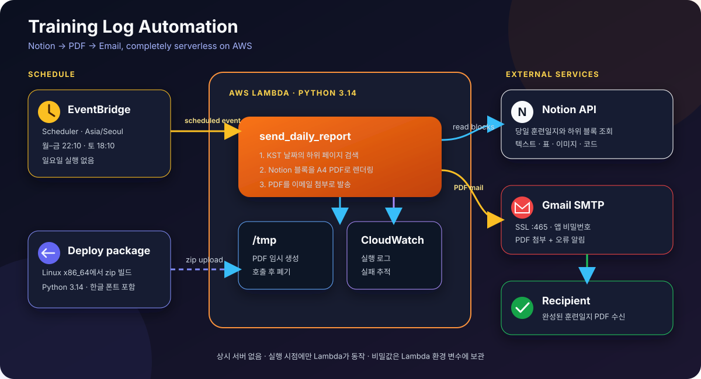

# 훈련일지 자동 메일 발송

Notion의 당일 훈련일지 페이지를 읽어 한글 PDF로 변환하고 이메일로 보내는 서버리스 자동화입니다. 운영 환경에서는 **AWS Lambda**가 문서를 만들고, **EventBridge Scheduler**가 한국 시간 기준 발송 시각을 관리합니다.

<p align="left">
  
  
  
  
  
</p>

## 현재 운영 상태

| 항목 | 운영 구성 |
| --- | --- |
| 실행 환경 | AWS Lambda · Python 3.14 · x86_64 |
| 스케줄 | 월–금 22:10, 토 18:10, 일요일 미실행 |
| 시간대 | `Asia/Seoul` |
| 문서 원본 | Notion `훈련일지` 상위 페이지의 당일 하위 페이지 |
| 결과물 | A4 PDF 이메일 첨부 |
| 모니터링 | CloudWatch Logs + 오류 알림 메일 |
| 이전 환경 | GCP VM cron 제거 완료 |

> 운영 발송 시각은 EventBridge Scheduler가 관리합니다. `schedule.json`과 5분 폴링 로직은 로컬 또는 VM cron 실행용이며 Lambda에서는 사용하지 않습니다.

## 아키텍처

<p align="center">
  
</p>

발송 한 번의 흐름은 다음과 같습니다.

1. EventBridge Scheduler가 KST 일정에 맞춰 Lambda를 호출합니다.
2. Lambda가 오늘 날짜와 일치하는 Notion 하위 페이지를 찾습니다.
3. 텍스트, 목록, 표, 코드, 이미지 등 Notion 블록을 재귀적으로 읽습니다.
4. 번들된 NanumBarunGothic 폰트로 `/tmp`에 A4 PDF를 생성합니다.
5. Gmail SMTP로 PDF를 첨부해 수신자에게 발송합니다.
6. 실행 로그는 CloudWatch Logs에 남고, 실패하면 발신 계정으로 오류 알림을 보냅니다.

## 주요 기능

- **Notion 문서 변환** — 제목, 문단, 목록, 할 일, 인용문, 콜아웃, 코드, 표, 이미지와 중첩 블록 지원
- **한글 PDF** — Lambda 패키지에 한글 폰트를 함께 넣어 시스템 폰트에 의존하지 않음
- **서버리스 스케줄링** — 상시 VM 없이 예약 시각에만 Lambda 실행
- **요일별 운영 일정** — 평일과 토요일을 별도 스케줄로 관리하고 일요일은 실행하지 않음
- **수동 재발송** — Lambda 테스트 이벤트의 `date` 값으로 원하는 날짜를 다시 발송
- **스팸 분류 완화** — 본문, `Date`, `Message-ID` 헤더를 명시적으로 구성
- **이중 오류 경로** — Lambda 실패 기록과 오류 알림 메일을 함께 사용

## 환경 변수

로컬에서는 `.env`, Lambda에서는 함수 환경 변수로 같은 값을 주입합니다.

| 변수 | 필수 | 설명 |
| --- | --- | --- |
| `NOTION_TOKEN` | 예 | Notion Internal Integration Secret |
| `NOTION_PARENT_PAGE_ID` | 예 | `훈련일지` 상위 페이지 ID |
| `GMAIL_ADDRESS` | 예 | 발신 Gmail 주소 |
| `GMAIL_APP_PASSWORD` | 예 | 2단계 인증에서 발급한 Gmail 앱 비밀번호 |
| `RECIPIENT_EMAIL` | 예 | 결과 PDF 수신 주소 |
| `SENDER_DISPLAY_NAME` | 예 | 메일 제목과 발신자 표시에 사용할 이름 |
| `FONT_REGULAR` | 아니요 | 로컬 실행 시 사용할 일반 한글 폰트 경로 |
| `FONT_BOLD` | 아니요 | 로컬 실행 시 사용할 굵은 한글 폰트 경로 |
| `SCHEDULE_FILE` | 아니요 | CLI/cron 모드의 스케줄 파일 경로 |
| `CRON_INTERVAL_MINUTES` | 아니요 | CLI/cron 모드의 실행 허용 구간, 기본값 5분 |

```bash
cp .env.example .env
```

### Notion 연결

1. [Notion Integrations](https://www.notion.so/my-integrations)에서 Internal Integration을 만듭니다.
2. `NOTION_TOKEN`에 발급된 Secret을 설정합니다.
3. Notion의 `훈련일지` 상위 페이지에서 **연결 추가(Connections)**로 Integration을 연결합니다.

상위 페이지에 연결하지 않으면 Notion API가 페이지를 찾지 못해 404를 반환합니다.

### Gmail 앱 비밀번호

1. 발신 Google 계정에서 2단계 인증을 켭니다.
2. [앱 비밀번호](https://myaccount.google.com/apppasswords)를 생성합니다.
3. 공백을 제거한 16자리 값을 `GMAIL_APP_PASSWORD`에 설정합니다.

일반 Google 계정 비밀번호는 사용하지 않습니다.

## 로컬 실행

### 설치

```bash
python -m venv .venv
source .venv/bin/activate      # Windows: .venv\Scripts\activate
pip install -r requirements.txt
```

Linux에서 로컬 PDF를 만들 때는 한글 폰트를 설치합니다.

```bash
sudo apt update
sudo apt install -y fonts-nanum
```

### PDF만 생성

```bash
python send_daily_report.py --dry-run
python send_daily_report.py --dry-run --date 2026-09-16
```

생성된 PDF는 `output/`에 저장됩니다.

### 즉시 발송

```bash
python send_daily_report.py --force
python send_daily_report.py --force --date 2026-09-16
```

`--force`는 로컬용 `schedule.json`과 중복 발송 플래그를 무시하므로, 운영 메일을 보낼 때만 주의해서 사용합니다.

## AWS 배포

### 1. Lambda 패키지 빌드

Lambda 런타임과 동일한 Python 버전의 Linux x86_64 환경에서 빌드해야 합니다. Pillow 같은 바이너리 wheel의 ABI가 런타임과 일치해야 하기 때문입니다.

```bash
sudo apt install -y fonts-nanum zip
PY_VERSION=3.14 bash scripts/build_lambda_package.sh
```

결과물은 `dist/traininglog-lambda.zip`입니다. 코드, Python 의존성, NanumBarunGothic 일반·굵은 폰트가 함께 들어갑니다.

> Lambda 런타임을 바꾸면 `PY_VERSION`도 반드시 같은 버전으로 바꿔 다시 빌드해야 합니다.

### 2. Lambda 함수 설정

| 항목 | 값 |
| --- | --- |
| Runtime | Python 3.14 |
| Architecture | x86_64 |
| Handler | `send_daily_report.lambda_handler` |
| Memory | 512 MB |
| Timeout | 60초 |
| VPC | 연결하지 않음 |

Notion API와 Gmail SMTP에 인터넷으로 연결해야 하므로 Lambda를 VPC에 넣지 않습니다. 이 워크로드에 NAT Gateway를 추가하면 불필요한 고정 비용이 생길 수 있습니다.

### 3. EventBridge Scheduler

두 스케줄 모두 시간대를 `Asia/Seoul`로 지정하고 대상을 Lambda 함수로 설정합니다.

| 대상 요일 | Scheduler cron 식 |
| --- | --- |
| 월–금 22:10 | `cron(10 22 ? * MON-FRI *)` |
| 토 18:10 | `cron(10 18 ? * SAT *)` |

일요일은 스케줄을 만들지 않습니다. 기존 EventBridge Rules가 아니라 시간대를 직접 지정할 수 있는 **EventBridge Scheduler**를 사용합니다.

### 4. 테스트 이벤트

오늘자 문서를 실제 발송합니다.

```json
{}
```

PDF 생성까지만 테스트합니다.

```json
{"dry_run": true}
```

특정 날짜를 재발송합니다.

```json
{"date": "2026-09-16"}
```

## 로컬 스케줄 모드

`schedule.json`은 Lambda가 아닌 CLI/cron 실행을 위한 호환 경로입니다.

```json
{
  "mon": { "enabled": true, "time": "22:10" },
  "sat": { "enabled": true, "time": "18:10" },
  "sun": { "enabled": false, "time": "22:10" }
}
```

5분마다 스크립트를 실행하면 코드가 KST 기준 요일·시각과 당일 발송 여부를 판단합니다.

```cron
*/5 * * * * cd /path/to/TrainingLog && .venv/bin/python send_daily_report.py
```

> 현재 운영 환경은 Lambda입니다. cron을 함께 켜면 같은 메일이 두 번 발송될 수 있으므로 운영 환경에서는 하나만 사용하세요.

## 로그와 오류 처리

| 환경 | 로그 위치 | 오류 처리 |
| --- | --- | --- |
| AWS Lambda | CloudWatch Logs | Lambda 호출 실패 + 발신 Gmail로 오류 메일 |
| 로컬/cron | `logs/app.log` | 종료 코드 1 + 발신 Gmail로 오류 메일 |

로컬 로그는 최대 1 MB 파일 3개로 순환합니다. Lambda에서는 읽기 전용 파일시스템 제약 때문에 파일 로그를 만들지 않고 표준출력을 CloudWatch로 보냅니다.

## 프로젝트 구조

```text
TrainingLog/
├── send_daily_report.py             # CLI 및 Lambda 진입점
├── requirements.txt                 # requests, reportlab, Pillow 등
├── schedule.json                    # 로컬/cron 전용 일정
├── .env.example                     # 환경 변수 템플릿
├── scripts/
│   └── build_lambda_package.sh      # Linux x86_64 배포 zip 생성
└── docs/
    └── architecture.svg             # README 아키텍처 다이어그램
```

## 보안과 비용

- `.env`, Notion 토큰, Gmail 앱 비밀번호는 커밋하지 않습니다.
- 실제 비밀값은 Lambda 환경 변수에만 보관하고 배포 zip에는 넣지 않습니다.
- Gmail 앱 비밀번호가 노출되면 즉시 폐기하고 새로 발급합니다.
- 하루에 짧게 실행되는 경량 워크로드라 일반적으로 AWS 프리 티어 범위에 머물지만, 실제 사용량과 계정 정책은 AWS Billing에서 확인합니다.

## 라이선스

개인 업무 자동화 및 학습 목적으로 제작되었습니다.

---

<p align="center">
  <sub>Built with Python · Notion API · ReportLab · AWS Lambda · EventBridge Scheduler · Gmail SMTP</sub>
</p>
